# AIM4LAB LocalCustomGUI

고압차단기 형상/시험 변수 기반 성능 예측을 로컬 PC에서 실행하는 Windows용 GUI 프로그램입니다. Excel 데이터를 올리고, 모델 학습/예측/성능 비교/결과 정리를 한 화면에서 진행할 수 있습니다. LLM은 예측값을 직접 만들지 않고, 저장된 모델과 실행 결과를 바탕으로 사용자가 이해하기 쉽게 설명합니다.


## 무엇을 할 수 있나

- 학습용 Excel 데이터를 업로드하고 데이터 구조를 확인합니다.
- classification 또는 regression 모델을 학습하고 저장합니다.
- 저장된 모델로 새 Excel 파일을 예측합니다.
- 모델 성능, 후보 모델 비교, 예측 결과를 표와 리포트로 확인합니다.
- Ollama 또는 vLLM 로컬 LLM을 연결해 한국어로 작업을 요청하고 결과를 설명받습니다.
- Windows 매니저 EXE 하나로 설치, 서버 실행, 삭제를 처리합니다.

## 기능 분석 요약

| 영역 | 기능 | 확인한 동작 |
| --- | --- | --- |
| Runtime | Ollama/vLLM 설정, 모델 선택, Context Length, Health | Ollama endpoint와 모델 목록을 확인하고 `ollama OK` 상태를 표시합니다. |
| 데이터 업로드 | 학습용 Excel 업로드, 활성 dataset 관리 | `serving/class_extracted.xlsx` 기준 학습 dataset 등록/Apply/Delete 목록을 확인했습니다. |
| 모델 관리 | 저장 모델 목록, 선택 모델 상세, schema/metric 확인 | classification 저장 모델 목록과 선택 모델 metric/schema 상세가 표시됩니다. |
| 예측 입력 | 저장 모델 기반 Excel batch 예측, 1-row 직접 입력 | `분류 예측` 요청으로 예측 입력 패널이 열리고 schema 기반 입력 변수가 표시됩니다. |
| 성능 비교 | 저장 모델 비교, 자동 후보 모델 비교, raw payload 보기 | `성능비교` 요청으로 비교표와 `원본 결과 보기 / 닫기` 토글이 생성됩니다. |
| 리포트 | PDF/Markdown 분석 자료 생성 | `리포트 생성` 요청 후 다운로드 버튼과 저장 경로가 표시됩니다. |
| 채팅 정리 | Chat Clear, Clear now 확인 | 현재 채팅과 예측 결과 표시를 확인 후 삭제하고 기본 안내 상태로 돌아갑니다. |

## 전체 흐름

1. `LocalCustomGUI-Manager.exe`를 실행합니다.
2. `Install / Repair`로 필요한 환경을 설치합니다.
3. `Run App`을 눌러 Streamlit 서버를 켭니다.
4. 브라우저에서 `http://127.0.0.1:8791`에 접속합니다.
5. Excel 업로드, 모델 학습, 예측, 결과 다운로드를 진행합니다.
6. 필요하면 Manager의 `Uninstall` 탭 또는 Windows 프로그램 추가/제거에서 삭제합니다.

## 1. EXE 실행 및 설치

프로젝트 폴더의 `LocalCustomGUI-Manager.exe`를 더블클릭합니다. 처음 실행하면 아래와 같은 AIM4LAB 매니저 창이 열립니다.

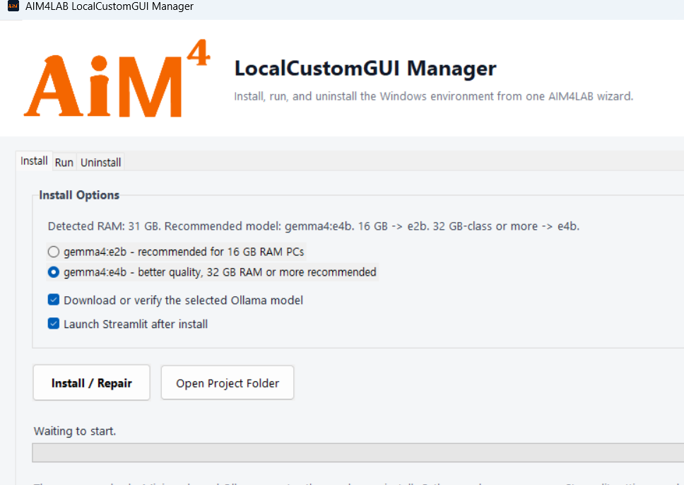

설치 단계:

1. `Download or verify Ollama model`을 켜 둡니다.
   기본 모델은 `gemma4:e2b`입니다.
2. 설치가 끝나자마자 앱을 열고 싶으면 `Launch Streamlit after install`을 켜 둡니다.
3. `Install / Repair`를 누릅니다.
4. Manager가 Miniconda, Ollama, conda 환경, Python 패키지, Streamlit 설정, Ollama 모델을 순서대로 확인하고 준비합니다.
5. 설치가 끝나면 Windows `프로그램 추가/제거`에 `AIM4LAB LocalCustomGUI`가 등록됩니다.

설치가 중간에 끊겼거나 다른 PC에서 다시 세팅할 때도 같은 버튼을 다시 누르면 됩니다. 이미 설치된 항목은 확인 후 건너뛰고, 부족한 항목만 보완합니다.

## 2. 서버 실행

설치 후 Manager의 `Run` 탭에서 서버를 실행합니다.

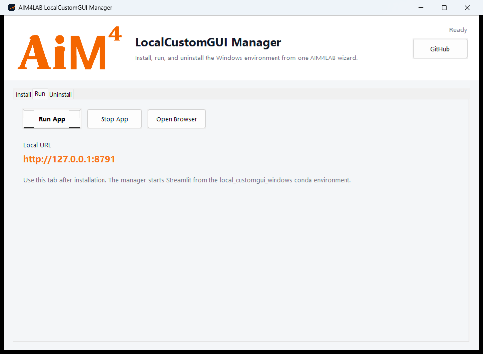

실행 단계:

1. `Run App`을 누릅니다.
2. 로컬 URL `http://127.0.0.1:8791`이 표시됩니다.
3. `Open Browser`를 누르거나 브라우저 주소창에 URL을 입력합니다.
4. 서버를 멈추려면 `Stop App`을 누릅니다.

서버가 실행 중일 때 Manager 창의 닫기 버튼을 누르면 서버는 종료되지 않고 Windows 시스템 트레이로 숨겨집니다. 트레이 아이콘을 우클릭하면 `Open GUI`, `Restart Server`, `Quit Server`, `Open Browser`를 사용할 수 있습니다.

## 3. 서버 기능

브라우저 왼쪽 `Runtime` 영역에서 로컬 LLM 서버를 관리합니다.

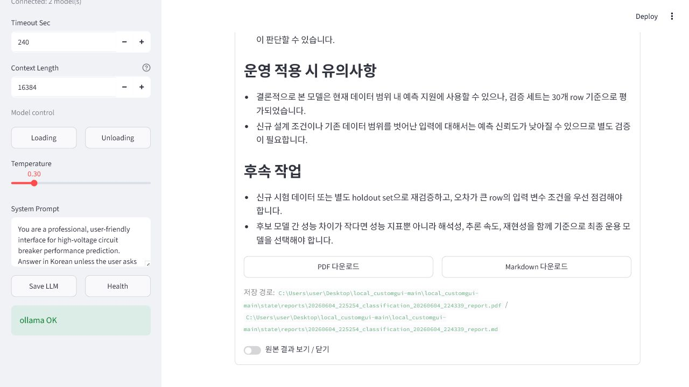

주요 설정:

- `Backend`: Ollama 또는 vLLM을 선택합니다.
- `Base URL`: Ollama는 보통 `http://127.0.0.1:11434`, vLLM은 OpenAI-compatible endpoint를 입력합니다.
- `Model`: 사용할 로컬 모델을 선택합니다.
- `Context Length`: 기본값은 `16384`입니다.
- `Loading` / `Unloading`: Ollama 모델 로딩 상태를 확인하거나 정리합니다.
- `Save LLM`: 현재 LLM 설정을 `config.json`에 저장합니다.
- `Health`: LLM endpoint와 모델 목록 연결 상태를 확인하고 `ollama OK`처럼 상태를 표시합니다.

LLM 연결이 실패해도 Excel 업로드, 모델 학습, 저장 모델 예측, 모델 관리 기능은 계속 사용할 수 있습니다.

## 4. 사용자 사용법

### Excel 업로드

상단의 `학습용 Excel 데이터셋 업로드 / 관리`를 펼치고 `Upload` 버튼으로 `.xlsx` 또는 `.xls` 파일을 선택합니다. 테스트용 파일은 `serving/class_extracted.xlsx` 또는 `serving/Reg_extracted.xlsx`를 쓰면 됩니다.

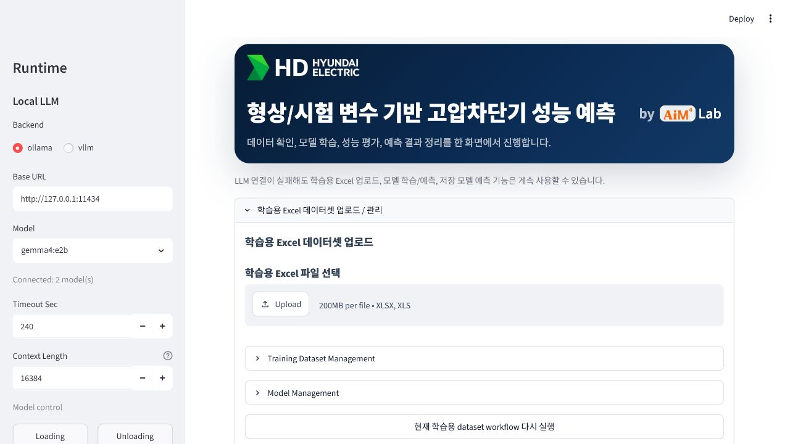

업로드 후 진행:

1. 데이터셋이 등록되면 컬럼과 데이터 타입을 확인합니다.
2. 데이터 타입이 자동 판별되지 않으면 classification 또는 regression을 선택합니다.
3. `현재 학습용 dataset workflow 다시 실행` 또는 채팅 입력창을 통해 학습/예측 흐름을 실행합니다.

### 학습 데이터셋 관리

`Training Dataset Management`를 열면 등록된 학습 데이터셋 목록을 볼 수 있습니다.

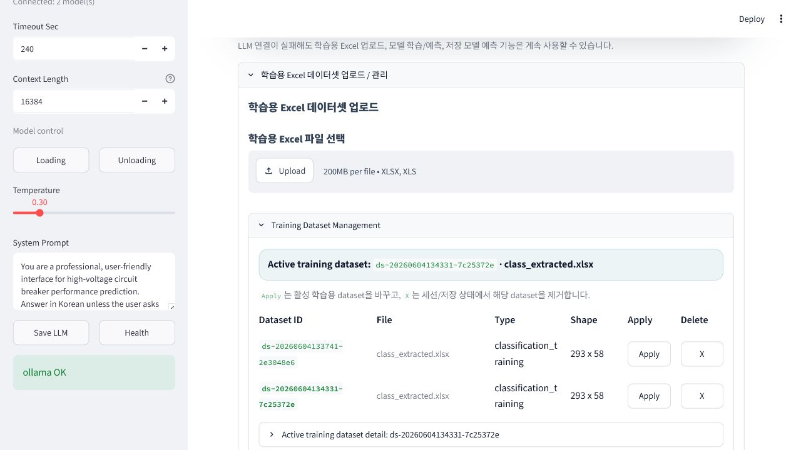

관리 기능:

1. `Active training dataset`에서 현재 학습 대상 파일을 확인합니다.
2. `Apply`로 이후 채팅/학습 요청에 사용할 dataset을 바꿉니다.
3. `X`로 세션/저장 상태에서 해당 dataset을 제거합니다.
4. 상세 패널에서 활성 dataset의 컬럼, shape, 판별 타입을 확인합니다.

### 모델 관리

`Model Management`를 열면 저장된 모델 목록과 선택 모델 상세를 볼 수 있습니다.

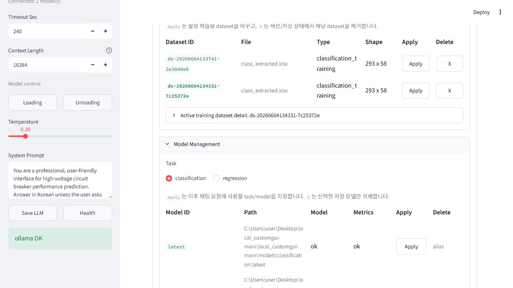

관리 기능:

1. `classification` 또는 `regression` task를 선택합니다.
2. `Apply`로 이후 예측/성능비교에 사용할 모델을 지정합니다.
3. `X`로 선택한 저장 모델을 삭제합니다. `latest` alias는 삭제 대상이 아닙니다.
4. `Selected model detail`에서 metric과 schema를 펼쳐 확인합니다.

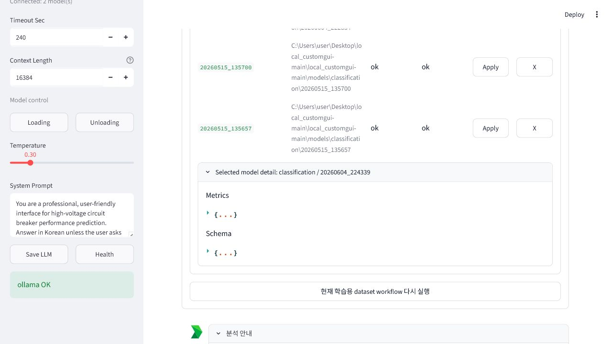

### 예측 입력

하단 채팅 입력창에 `분류 예측` 또는 `회귀 예측`처럼 입력하면 `예측 입력` 패널이 열립니다.

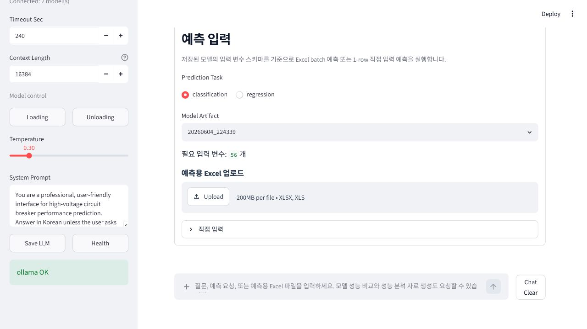

예측 방식:

1. `Prediction Task`에서 classification 또는 regression을 선택합니다.
2. `Model Artifact`에서 사용할 저장 모델을 선택합니다.
3. `예측용 Excel 업로드`에 `serving/class_extracted.xlsx` 또는 `serving/Reg_extracted.xlsx` 같은 파일을 넣어 batch 예측을 실행합니다.
4. Excel 대신 한 행만 확인하려면 `직접 입력`을 펼칩니다.

`직접 입력`은 저장 모델 schema의 입력 변수 수만큼 숫자 입력칸을 자동으로 만듭니다. 기본값은 활성 학습 dataset의 중앙값을 기준으로 채워집니다.

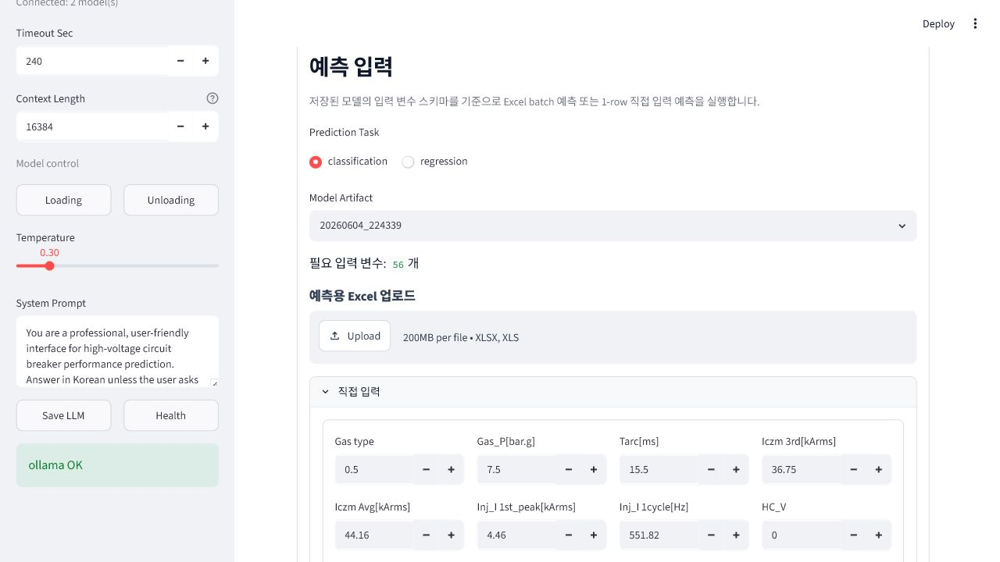

### 성능 비교와 세부 결과 확인

학습이 끝나면 저장 모델 비교표와 자동 후보 모델 비교표가 표시됩니다.

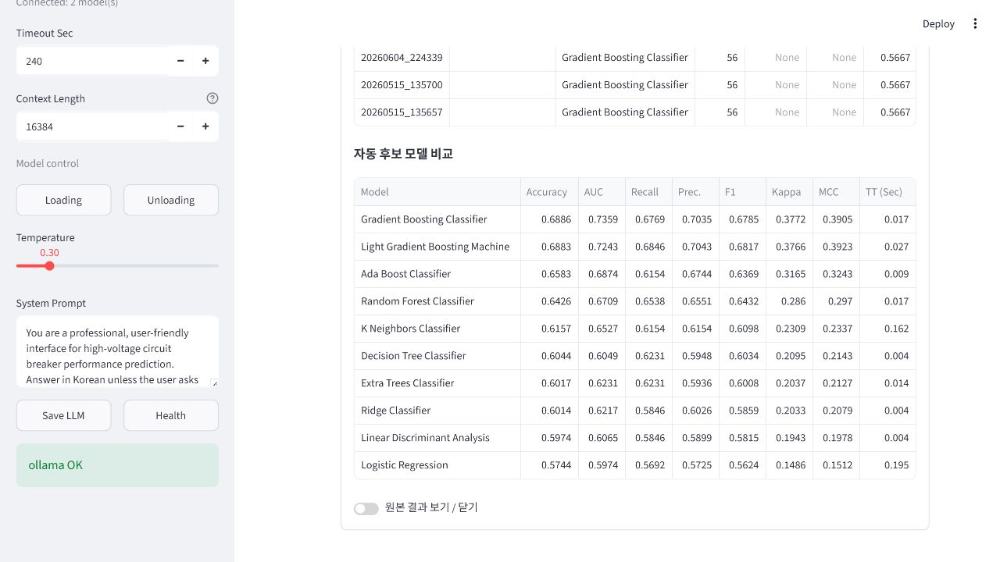

확인할 항목:

1. 저장된 모델의 `model_id`와 `best_model`을 확인합니다.
2. classification은 Accuracy, AUC, F1 등 주요 지표를 확인합니다.
3. regression은 R2, RMSE 등 주요 지표를 확인합니다.
4. 필요한 모델을 선택해 이후 예측에 사용합니다.
5. 후보 모델 비교표에서 현재 모델과 대안 모델의 성능 차이를 확인합니다.

세부 JSON 결과가 필요하면 `원본 결과 보기 / 닫기` 토글을 켭니다.

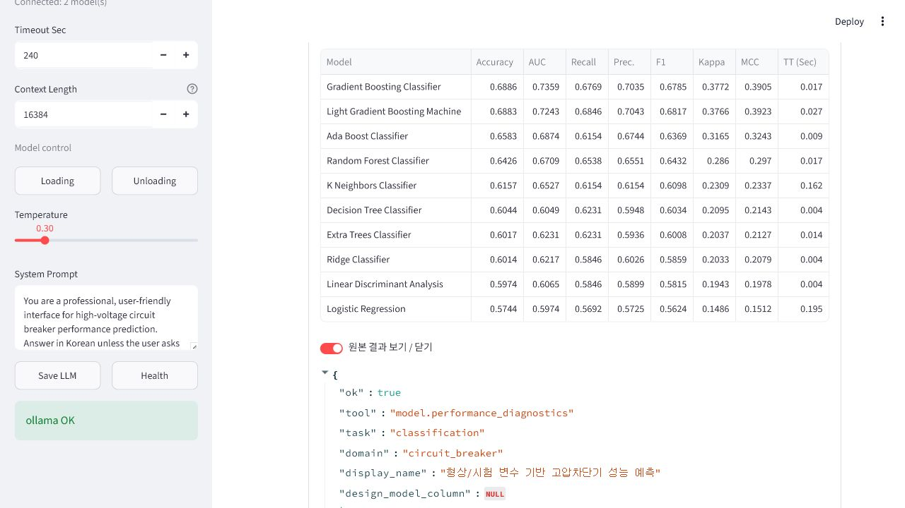

### 리포트 다운로드

채팅 입력창에 `리포트 생성`을 입력하면 선택된 모델 기준으로 성능 분석 자료를 만듭니다.

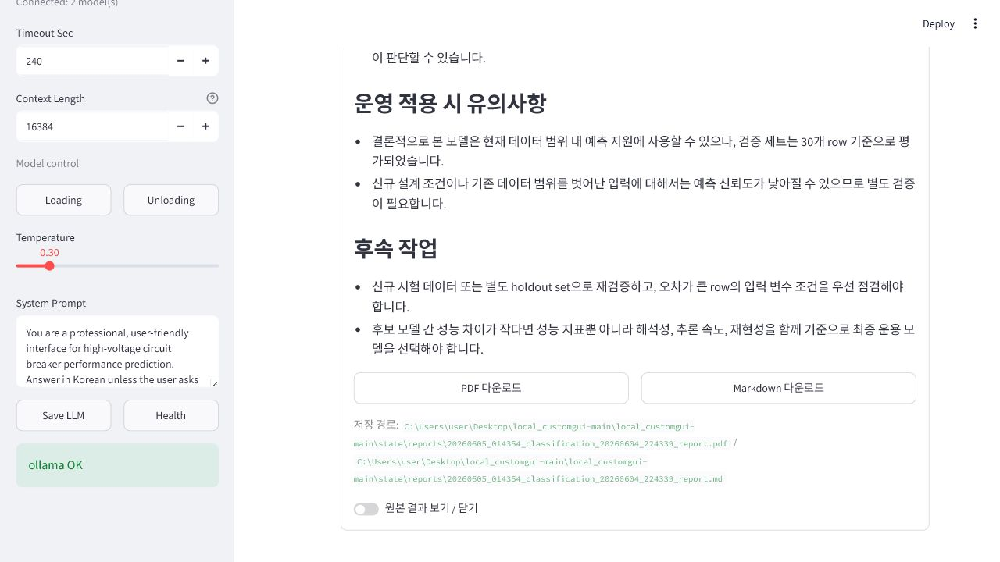

다운로드 기능:

1. `PDF 다운로드`로 공유용 리포트 파일을 받습니다.
2. `Markdown 다운로드`로 편집 가능한 문서 원문을 받습니다.
3. 다운로드 버튼 아래 저장 경로에서 생성된 파일 위치를 확인합니다.

### 채팅으로 요청하기

하단 채팅 입력창에 자연어로 요청할 수 있습니다.

예시:

```text
방금 올린 엑셀 요약해줘
분류 모델 학습해줘
저장된 분류 모델로 예측해줘
모델 성능 비교표를 설명해줘
예측 결과 리포트 만들어줘
```

LLM은 요청을 해석해 데이터 요약, 학습, 예측, 성능 비교, 리포트 생성 도구를 호출합니다. 실제 예측은 저장된 모델 artifact가 수행합니다.

### Chat Clear

오른쪽 아래 `Chat Clear`는 현재 채팅 내용과 예측 결과 표시를 정리합니다. 학습 dataset과 저장 모델 파일을 삭제하는 기능은 아닙니다.

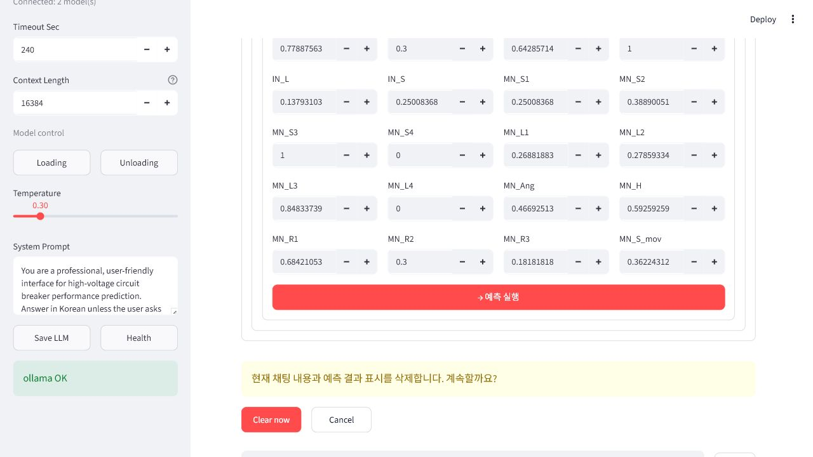

정리 단계:

1. `Chat Clear`를 누릅니다.
2. 확인 경고가 뜨면 `Clear now`를 누릅니다.
3. 취소하려면 `Cancel`을 누릅니다.
4. 정리 후 기본 `분석 안내` 화면으로 돌아갑니다.

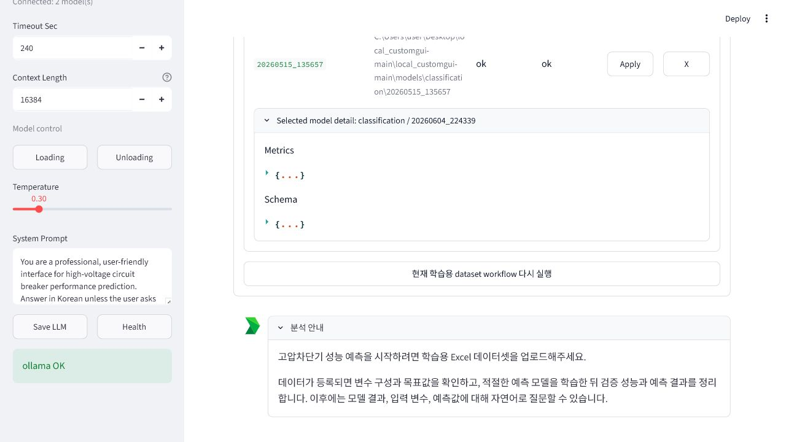

## 5. 삭제

Manager의 `Uninstall` 탭에서 삭제할 항목을 선택합니다.

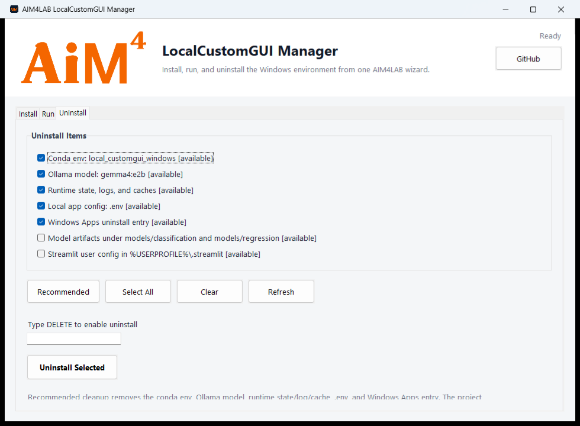

삭제 단계:

1. `Recommended`를 누르면 일반적인 재설치 테스트에 필요한 항목이 선택됩니다.
2. 필요한 경우 `Select All` 또는 개별 체크박스로 삭제 범위를 조정합니다.
3. 입력칸에 `DELETE`를 입력합니다.
4. `Uninstall Selected`를 누릅니다.
5. 확인 창에서 삭제 대상 목록을 다시 확인한 뒤 진행합니다.

기본 추천 삭제 항목:

- conda 환경 `local_customgui_windows`
- Ollama 모델 `gemma4:e2b`
- runtime state, logs, caches
- `.env`
- Windows 프로그램 추가/제거 등록 항목

프로젝트 폴더 자체는 자동으로 삭제하지 않습니다. 모델 artifact와 Streamlit 사용자 설정은 별도 체크박스를 켰을 때만 삭제됩니다.

Windows 설정의 `프로그램 추가/제거`에서 `AIM4LAB LocalCustomGUI`를 제거해도 같은 Manager Uninstall 화면으로 이동합니다.

## 6. 자주 생기는 상황

`conda` 명령이 PowerShell에서 인식되지 않아도 괜찮습니다. Manager는 일반적인 Miniconda 설치 경로에서 `conda.exe`를 직접 찾아 실행합니다.

Ollama 모델 다운로드는 처음 한 번 오래 걸릴 수 있습니다. 모델 파일은 EXE 안에 들어있지 않고 Ollama 모델 저장소에 따로 저장됩니다.

Streamlit이 이메일 입력을 묻는 경우 Manager 설치를 다시 실행하면 사용자 Streamlit 설정이 준비됩니다. 수동 실행 시에는 [수동 설치 문서](docs/manual_installation.md)의 실행 명령을 사용하세요.

Ollama Desktop의 Context length는 16k 근처로 맞추는 것을 권장합니다. 앱 내부 `Context Length` 기본값도 `16384`입니다.

## 7. 문서와 파일 구조

- [수동 설치 및 개발자 명령](docs/manual_installation.md)
- [프로젝트 요약](docs/project_summary.md)
- [원본 노트북 참고 메모](docs/source_notes.md)

주요 파일:

```text
LocalCustomGUI-Manager.exe          Windows 설치/실행/삭제 매니저
streamlit_app.py                    사용자용 Streamlit GUI
src/hd_serving/                     데이터 처리, 학습, 예측, LLM 도구 패키지
models/                             저장된 모델 artifact
data/raw/                           예제 Excel 데이터
docs/assets/screenshots/            README 스크린샷
packaging/windows/                  Windows EXE 빌드 소스
```
