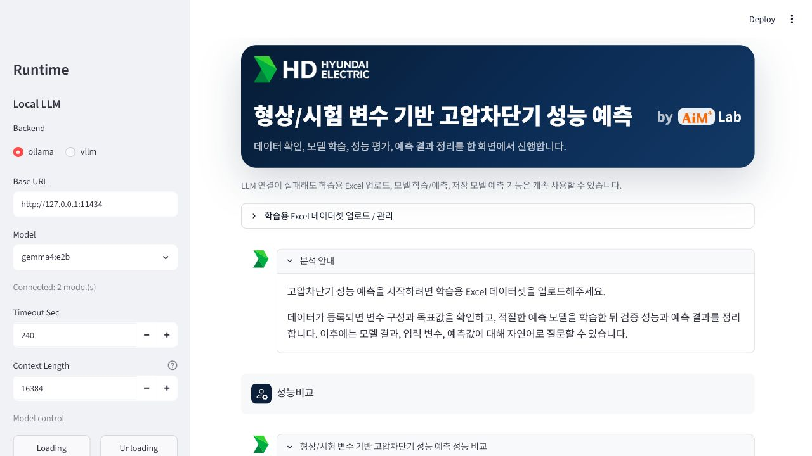

# 기능별 자연어 사용 가이드

LocalCustomGUI는 채팅 입력창에 자연어를 넣어 데이터 요약, 모델 학습, 예측, 성능 비교, 리포트 생성을 실행할 수 있습니다. 아래 문서는 실제 앱 코드 흐름을 기준으로 각 명령의 준비 조건, 화면 확인 위치, 결과물을 정리한 사용자용 페이지입니다.

## 빠른 링크

| 입력 예시 | 상세 문서 | 주요 결과 |
| --- | --- | --- |
| `방금 올린 엑셀 요약해줘` | [Excel 요약](excel-summary.md) | active dataset의 행/열, 컬럼, 미리보기, target 분포 |
| `분류 모델 학습해줘` | [분류 모델 학습](classification-training.md) | classification 모델 artifact, 검증 지표, 후보 모델 비교 |
| `저장된 분류 모델로 예측해줘` | [저장 모델 예측](saved-classification-prediction.md) | batch prediction 결과표, result_id, 다운로드 |
| `모델 성능 비교표를 설명해줘` | [성능 비교 설명](performance-comparison.md) | 저장 모델 비교표, 자동 후보 모델 비교, raw payload |
| `예측 결과 리포트 만들어줘` | [리포트 생성](report-generation.md) | Markdown/PDF 리포트, 예시 산출물 |

## 공통 준비

1. `LocalCustomGUI-Manager.exe`에서 서버를 실행합니다.
2. 브라우저에서 `http://127.0.0.1:8791`을 엽니다.
3. 상단 `학습용 Excel 데이터셋 업로드 / 관리`에서 Excel 파일을 업로드합니다.
4. 채팅 입력창에 원하는 명령을 입력합니다.

LLM 연결이 실패해도 데이터 요약, 모델 학습, 저장 모델 예측, 모델 관리 기능은 내부 tool로 계속 동작합니다. 단, 사용자가 보는 설명 문장의 자연스러움은 연결된 로컬 LLM 상태에 따라 달라질 수 있습니다.

작업을 끝낼 때는 Manager의 `Stop App` 또는 트레이 메뉴의 `Quit Server`를 사용합니다. 이 버튼은 Streamlit 서버와 앱용 백그라운드 프로세스를 정리하고, Ollama에 로딩된 `gemma4:e2b` / `gemma4:e4b` 모델도 언로드합니다.

## 관련 화면

